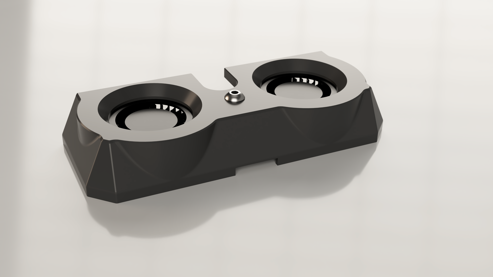
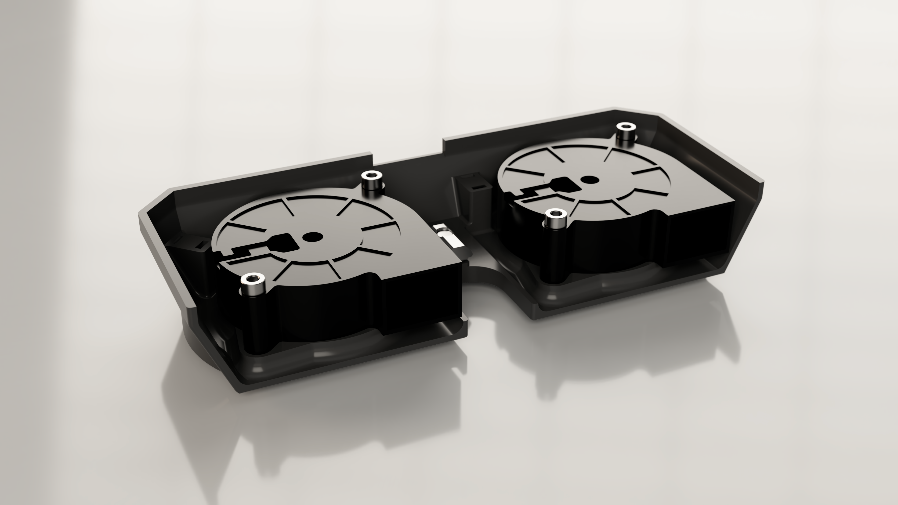

[![CC BY-NC-SA 4.0][cc-by-nc-sa-shield]][cc-by-nc-sa]

# Monolith Bed Fans for Voron 2.4 [WIP]
 
## What's this?
This is a bed fan shroud for 4x5015 bed fan configurations. Not as clean as I'd like, but I'll continue to work on it when I have the time.

## BOM
### DISCLAIMER: The BOM and files will change with more testing and feedback.

|No.|Description|Qty|
|---|---|---|
|1.|5015 radial cooling fans|4 pcs|
|2.|M3x20 SHCS|8 pcs|
|3.|M3x5x4mm heatset inserts|8 pcs|
|4.|M5x10 BHCS|2 pcs|
|5.|M5 roll in T-nut|2 pcs|
|6.|Zip ties|4 pcs|

If you've any got questions you can find me on Discord ***@CloakedWayne***
    
This work is licensed under a
[Creative Commons Attribution-NonCommercial-ShareAlike 4.0 International License][cc-by-nc-sa].

[![CC BY-NC-SA 4.0][cc-by-nc-sa-image]][cc-by-nc-sa]

[cc-by-nc-sa]: http://creativecommons.org/licenses/by-nc-sa/4.0/
[cc-by-nc-sa-image]: https://licensebuttons.net/l/by-nc-sa/4.0/88x31.png
[cc-by-nc-sa-shield]: https://img.shields.io/badge/License-CC%20BY--NC--SA%204.0-lightgrey.svg
